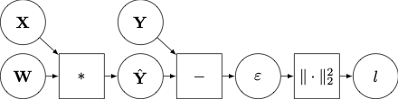

# Towards AD in Julia: Composition of Rules

Prerequisites: [Algorithmic Differentiation](@ref).

In [Mooncake.jl's Rule System](@ref) we discuss a generic mathematical model for a Julia `function`, and state what a rule to differentiate it in reverse-mode must do.
Our goal, however, is to implement an algorithm which produces rules for functions which we do not already have rules for.
This section explains the mathematical model required to know how to do this.

## A Motivating Example

By the end of this section we will understand why, for the following function:
```julia
function f(x, y)
    a = g(x)
    b = h(a, y)
    return b
end
```
the following rule is a correct implementation of reverse-mode AD for it:
```julia
function r(f, x, y)
    a, adj_g = r(g, x)
    b, adj_h = r(h, a, x, y)
    function adj_f(db)
        _, da, dx, dy = adj_h(db)
        _, dx2 = adj_g(da)
        dx = Mooncake.increment!!(dx, dx2)
        return NoRData(), dx, dy
    end
    return b, adj_f
end
```
Observe that the above rule essentially does the following:
1. fowards-pass: replace calls to rules.
2. reverse-pass: run adjoints in reverse order, adding together rdata when a variable is used multiple times.

This way of writing rules is the essence of the "A" in "AD".
This page is therefore dedicated to building up to this example via a sequence of increasingly general examples.
Once we have this, extending it to a _very_ general class of Julia functions is comparatively straightforward.

We shall adopt the following approach to each problem:
1. specify class of `function`s,
2. specify class of differentiable functions used to model these `function`s,
3. specify how to find the adjoints of this differentiable model, and
4. describe a rule system which implements these adjoints.

At a high level, you can think of this approach as first "mathematising" the problem, applying the techniques developed in [Algorithmic Differentiation](@ref) to determine what it is that AD must do, and then providing an outline for implementing this model as a computer programme.

## Part 1: Simple Compositions of Pure Functions

For this class of `function`s, the translation between the Julia `function` and differentiable function used to model it is almost trivial.
We ask for patience, and promise that the modelling task will become more interesting shortly!

### `function` Class

To start with, let us consider only `function`s which are pure (free of externally-visible side effects, such as the modification of their arguments of global variables), unary (single-argument), and don't contain any data themselves (e.g. no closures or callable `struct`s).
For example, consider:
#### `g`:
`g(x::Vector{Float64}) = 2x` TODO: pick a non-linear example!!!!

#### `h`:
`h(x::Matrix{Float64}) = sum(x)`.

#### Composition
Let `f` be the composition of `f_1, ..., f_N`, a collection of `N` Julia `function`s which are pure and unary.
This might be implemented as `f(x) := f_N ∘ ... ∘ f_1`, or perhaps
```julia
function f(x)
    x_1 = x
    x_2 = f_1(x_1)
    ...
    return f_N(x_N)
end
```
There are many ways to implement this function.

### Differentiable Model

We propose to represent any `function` `f` in this class by a differentiable function $$f : \mathcal{X} \to \mathcal{Y}$$.

#### `g`:
Let $$\mathcal{X} = \mathcal{Y} =: \mathbb{R}^D$$ where $$D$$ is `length(x)`, and $$f(x) := 2x$$.

#### `h`:
Let $$\mathcal{X} := \mathbb{R}^{P \times Q}$$, and $$\mathcal{Y} := \mathbb{R}$$, where $$P$$ and $$Q$$ are the number of rows and columns in `x`, and $$f(x) := \sum_{p,q} x_{p,q}$$.

#### Composition:
Let $$f_n : \mathcal{X}_n \to \mathcal{X}_{n+1}$$ be the differentiable model for `f_n`.
Then the differentiable model $$f : \mathcal{X} \to \mathcal{Y}$$ for `f` is $$f := f_N \circ \dots \circ f_1$$, with $$\mathcal{X} := \mathcal{X}_1$$ and $$\mathcal{Y} := \mathcal{X}_{N+1}$$.

### Adjoints of Model

You can apply the tools developed in [Algorithmic Differentiation](@ref) to figure out the adjoints of `g` and `h`.
The adjoint of `f` is also given there.
Let $$D f_n [x_n]^\ast$$ be the adjoint of the derivative of $$f_n$$ at $$x_n$$, then the adjoint of $$f$$ at $$x$$ is just
```math
D f [x]^\ast = D f_1 [x_1]^\ast \circ \dots \circ D f_N [x_N]^\ast.
```

### Rules

For this simple class of functions, a simple rule system will do.
We require that a rule for a `function` with mathematical model $$f$$ accepts the same argument as the original `function`, and returns a 2-tuple containing
1. the result of applying the `function` to its input, and
2. another function which implements[^implementing_mathematics_on_a_computer] the adjoint, i.e. $$D f [x]^\ast$$.

Given a rule for a `function` of interest, we simply run the rule, and can then apply the adjoint to any gradient vector of interest.

#### `g`:
```julia
function rrule(::typeof(g), x::Vector{Float64})
    g_adjoint(ȳ::Vector{Float64}) = 2ȳ
    return g(x), g_adjoint
end
```

#### `h`:
```julia
function rrule(::typeof(h), x::Matrix{Float64})
    h_adjoint(ȳ::Float64) = fill(ȳ, size(x))
    return h(x), h_adjoint
end
```

#### Composition:

One possible implementation for a rule for the composition of `f_1, ..., f_N` is
```julia
function rrule(::typeof(f), x)
    x_1 = x
    x_2, f_1_adjoint = rrule(f_1, x_1)
    ...
    y, f_N_adjoint = rrule(f_N, x_N)
    function f_adjoint(ȳ)
        x̄_N = f_N_adjoint(ȳ)
        ...
        x̄_1 = f_1_adjoint(x̄_2)
        x̄ = x̄_1
        return x̄
    end
    return y, f_adjoint
end
```
You should convince yourself that this does indeed return a 2-tuple satisfying the specification above.


## Part 2: Functions of Pure Functions

The previous example demonstrated how we might treat a composition of pure unary `function`s.
Here, we extend this to pure `function`s of multiple arguments.
To see an example of this, consider the following computation graph:


It describes the loss function associated to linear regression, and might be written as Julia code in the following way:
```julia
l2_norm_sq(x) = sum(abs2, x)
function linear_regression_loss(W, X, Y)
    Y_hat = X * W
    eps = Y - Y_hat
    return l2_norm_sq(eps)
end
```
As before, in order to produce a precise mathematical model for this Julia `function`, we reduce it to the composition of elementary functions.
However, in order to do so, we will have to be a little more creative in how we choose these functions.

We model this `function` as a function $$f$$ defined as follows:
```math
\begin{align}
    f :=&\, r \circ \varphi_3 \circ \varphi_2 \circ \varphi_1 \textrm{ where } \nonumber \\
    \varphi_1(W, X, Y) :=&\, (W, X, Y, XW) \nonumber \\
    \varphi_2(W, X, Y, \hat{Y}) :=&\, (W, X, Y, \hat{Y}, Y - \hat{Y}) \nonumber \\
    \varphi_3(W, X, Y, \hat{Y}, \varepsilon) :=&\, (W, X, Y, \hat{Y}, \varepsilon, \|\varepsilon\|_2^2) \nonumber \\
    r(W, X, Y, \hat{Y}, \varepsilon, l) :=&\, (W, X, Y, l) \nonumber
\end{align}
```
In words, our mathematical model for `linear_regression_loss` is the composition of four differentiable functions. The first three map from a tuple containing all variables seen so far, to a tuple containing the same variables _and_ the value returned by the function, and the fourth simple reads off the elements of the final tuple which were passed in as arguments, and the return value.

In general, we model the $n$th Julia `function` _call_ with a function $$\varphi_n$$ mapping from a tuple of $$D$$ elements to a tuple of $$D + 1$$ elements, of the form
```math
\varphi_n(x) := (x_1, \dots, x_D, g_n (a_n(x)))
```
for some differentiable function $$g_n$$, and "argument selector" function $$a_n$$.
In words: each function call involves
1. preparing the arguments to be passed to the function call, ($a_n$)
2. calling the function ($g_n$), and
3. adding a new variable to the list of in-scope variables (new tuple is of length $D + 1$).

For example, in the case of our example above,
```math
\begin{align}
    &\varphi_1:\quad a_1(x) := (x_2, x_1)  &\text{ and   } \quad &g_1(A,B) := AB \nonumber \\
    &\varphi_2:\quad a_2(x) := (x_3, x_4)  &\text{ and   } \quad &g_2(A,B) := A - B \nonumber \\
    &\varphi_3:\quad a_3(x) := x_5         &\text{ and   } \quad &g_3(A) := \|A\|_2^2 \nonumber
\end{align}
```
Note that the argument to $a_1$ is a 3-tuple, to $a_2$ a 4-tuple, and to $a_3$ a 5-tuple.
Crucially, observe that $$f$$ has exactly the same structure as $$g_1$$, $$g_2$$, and $$g_3$$ -- it maps from the tuple containing its arguments to a tuple comprising its arguments and the value that it returns.

Dropping the subscript $n$, functions such as $$\varphi$$ have derivative
```math
D [\varphi, x] (\dot{x}) = (\dot{x}_1, \dots, \dot{x}_D, D [g \circ a, x] (\dot{x})).
```
Letting $$\bar{y} := (\bar{y}_1, \dots \bar{y}_{D+1})$$, we can perform the usual manipulations to find the adjoint of $$D[\varphi, x]$$:
```math
\begin{align}
    \langle \bar{y}, D[\varphi, x](\dot{x}) \rangle &= \langle (\bar{y}_1, \dots, \bar{y}_{D+1}), (\dot{x}_1, \dots, \dot{x}_D, D[g \circ a, x](\dot{x})) \rangle \nonumber \\
        &= \sum_{d=1}^D \langle \bar{y}_d, \dot{x}_d \rangle + \langle D[g \circ a, x]^\ast (\bar{y}_{D+1}), \dot{x} \rangle \nonumber \\
        &= \langle (\bar{y}_1, \dots, \bar{y}_D), \dot{x} \rangle + \langle D[g \circ a, x]^\ast (\bar{y}_{D+1}), \dot{x} \rangle \nonumber \\
        &= \langle (\bar{y}_1, \dots, \bar{y}_D) + D[g \circ a, x]^\ast (\bar{y}_{D+1}), \dot{x} \rangle. \nonumber
\end{align}
```
So, what is $D[g \circ a, x]^\ast (\bar{y}_{D+1})$?.
First let $$z := a(x)$$ and observe that $$D[a, x] = a$$ since $$a$$ is linear.
It follows that
```math
D[g \circ a, x]^\ast = (D[g, z] \circ D[a, x])^\ast = (D[g, z] \circ a)^\ast = a^\ast \circ D[g, z]^\ast .
```

Since $g$ has the same form as $f$, assume that we know $D[g, z]^\ast$ by induction.
An expression for $$a^\ast$$, on the other hand, we obtain from its definition directly.

As discussed $a$ maps from a tuple containing all variables passed in to $f$, to the tuple which is to be passed to $g$.
For example, suppose variables `x_1, x_2, x_3` are in-scope, then a call of the form
1. `g(x_2, x_1)` has argument selector $a(x) := (x_2, x_1)$, and
2. `g(x_3, x_3)` has argument selector $a(x) := (x_3, x_3)$,
where $x$ is a 3-tuple in both examples.
The general form of an argument selector $a$ mapping from a $D$-tuple to an $N$-tuple is
```math
a(x) = (x_{i_1}, \dots, x_{i_N})
```
for some set of integers $i_1, \dots, i_N \in \{1, \dots, D\}$.
Let $z = (z_1, \dots, z_N)$, and $c_n(z)$ the $D$-tuple which is equal to $z_n$ at element $i_n$, and zero everywhere else. Then adjoint of $a$ is obtained in the usual manner:
```math
\begin{align}
\langle z, a^\ast (x) \rangle &= \langle (z_1, \dots, z_N), (x_{i_1}, \dots, x_{i_N}) \rangle = \sum_{n=1}^N \langle z_n, x_{i_n} \rangle = \sum_{n=1}^N \langle c_n(z), x \rangle = \langle \sum_{n=1}^N c_n(z), x \rangle, \nonumber
\end{align}
```
from which we conclude
```math
a^\ast(z) = \sum_{n=1}^N c_n(z). \nonumber
```
Applying this result to our previous examples, we see that
1. when $a(x) := (x_2, x_1)$, $a^\ast (z) := (z_2, z_1, 0)$, and that
2. when $a(x) := (x_3, x_3)$, $a^\ast (z) := (0, 0, z_1 + z_2)$.

Combining this result with the adjoint of the derivative of $\varphi$ yields
```math
D[\varphi, x]^\ast (\bar{y}) = (\bar{y}_1, \dots, \bar{y}_D) + \sum_{n=1}^N c_n(D [g, z]^\ast (\bar{y})).
```

Finally, we to find the derivative of the adjoint of $r$.
It is linear, so it is its own derivative.
Assume $f$ is of the form
```math
f = r \circ \varphi_P \circ \dots \circ \varphi_1
```
and that its arguments are $N$-tuples.
Then $r$ maps from $N + P$-tuples to an $N+1$-tuple, and its adjoint is a tuple of length $N + P$ given by
```math
r^\ast(\bar{y}) = (\bar{y}_1, \dots, \bar{y}_N, 0, \dots, 0, \bar{y}_{N+1}).
```
The adjoint the derivative of $f$ is
```math
D [f,x]^\ast = D[\varphi_1, x_1]^\ast \circ \dots \circ D [\varphi_P, x_P]^\ast \circ r^\ast
```
where $x_p := \varphi_{p-1}(x_{p-1})$ and $x_1 := x$.
Since we now have expressions for all of the terms in this, it remains to figure out how to implement this adjoint in practice.


## Part 3: Computational Graphs of Mutating Functions

## Part 4: Computational Graphs of Mutating Functions with Aliasing


[^implementing_mathematics_on_a_computer]: put differently, suppose that someone wrote down some equations in a paper or textbook, and gave you a piece of code which they claim is an implementation of these equations (e.g. a neural network, a probabilistic model, an ODE, etc). Under what conditions would you be satisfied that the implementation was correct? We all do this in informal ways all of the time. I propose that you apply the same set of standards here: we have written down some equations for the adjoints, and are claiming that our rule system is an implementation of these. The fact that we arrived at this set of equations by modelling a computer programme is neither here nor there for this step of the process.
